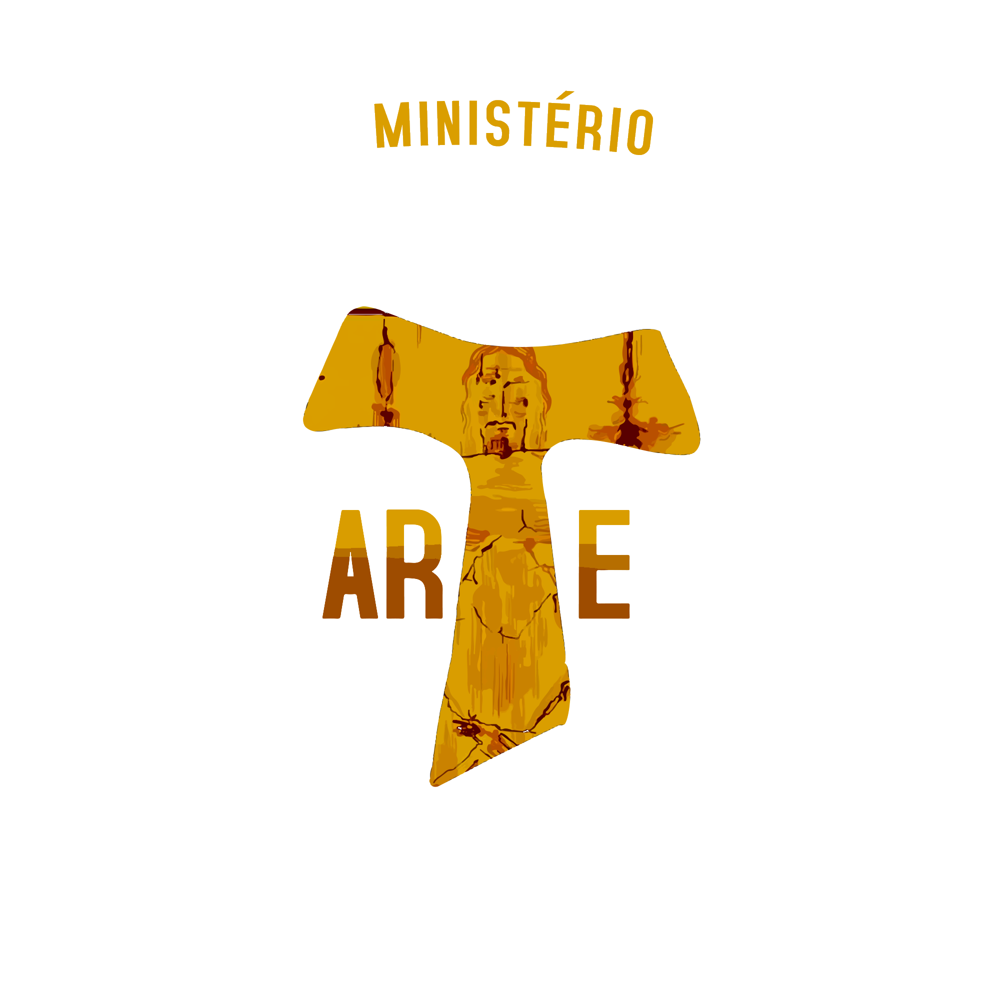

  
  <h1>🎭 Gestão de Elenco - Paixão de Cristo 2026</h1>
  
  

    
    
    
  

  

    <strong>Sistema de curadoria e ficha técnica para a produção teatral do Ministério de Artes Caravaggio.</strong>
     
    <i>Unindo tecnologia e arte para organizar a maior história de todos os tempos.</i>
  

## 📖 Sobre o Projeto
Este sistema foi concebido para resolver a necessidade de centralização de informações durante o processo de pré-produção da **Paixão de Cristo 2026**. Como videomaker e desenvolvedor, uni a necessidade estética da direção de arte com a funcionalidade de um sistema CRUD (Create, Read, Update, Delete) robusto.

## 🚀 Diferenciais Técnicos
- **Arquitetura SQL:** Uso de SQLite com SQLAlchemy para persistência de dados relacional.
- **Security First:** Implementação de `Session` e `Decorators` personalizados para proteger rotas administrativas.
- **Configuração via Environment:** Proteção de dados sensíveis seguindo as melhores práticas de mercado (Variáveis de Ambiente).
- **Estética Dark Mode:** Interface desenhada para reduzir a fadiga visual durante ensaios noturnos.

## 🛠️ Tecnologias
<table align="center">
  <tr>
    <td align="center" width="100">
       Python
    </td>
    <td align="center" width="100">
       Flask
    </td>
    <td align="center" width="100">
       SQLite
    </td>
    <td align="center" width="100">
       Git
    </td>
  </tr>
</table>

## ⚙️ Instalação e Uso
1. Clone o repositório: `git clone https://github.com/RaphaelDalarme/PaginaElencoPaix-oDeCristo.git`
2. Instale as dependências: `pip install -r requirements.txt`
3. Defina sua senha administrativa no ambiente: `export ADM_PASSWORD=suasenha`
4. Execute: `python app.py`

---

  <h3>🔗 Conecte-se Comigo</h3>
  

    
    
  

  
<i>Desenvolvido por Raphael Dalarme - 2026</i>

